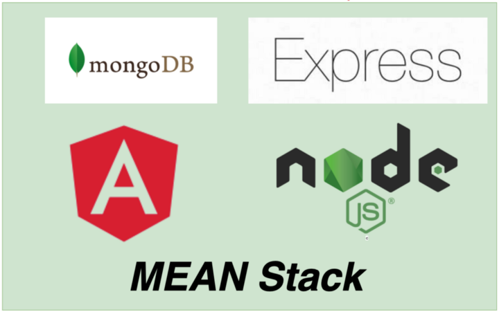

<h1 align="center"><i>Super-Dog-Academia</i></h1>

**_
Super-Dog-Academia is your home for the most comprehensive, accessible, and effective dog training in Bulgaria.Super-Dog Academia-certified trainers with more than 10 years of experience - all of whom are deeply passionate about dogs and how they can improve lives.We have courses for: Police dogs, Guide dogs and Guard Dogs
_**

<h4 align="center"><i>Stack: </i></h3>

- <i><b>Responsive Design</b></i>
- <i><b>Home page with contact info</b></i>
- <i><b>(Register, Login) page</b></i>
- <i><b>-</b></i>
- <i><b>Sing in course (user only) </b></i>
- <i><b> Courses(user only)</b></i>
- <i><b>Coaches (users only)</b></i>
- <i><b>Gallery (users and guest) </b></i>

 <b>Angular:</b>

- <b>ngRx state management </b>
- <b> Animations</b>
- <b> Routing</b>
- <b> Guards</b>
- <b> Template-Driven and Reactive Forms</b>
- <b> Interceptors ,Interfaces,Pipes</b>
- <b> Services</b>
- <b> Validators</b>
- <b> Unit testing for some components</b>
- <i><b>Others ( placeholders when loading, page not found, etc.)</b></i>

<b>The REST API is written with Express JS </b>

<h2>Used: </h2>
- <b>Node js</b>
- <b>JSON Web Token for the auth</b>
- <b>Bcrypt for password hashing</b>
- <b>Express Validator</b>
- <b>Mongoose</b>
